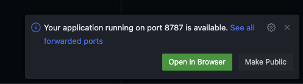
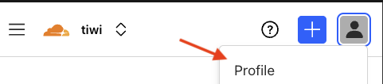
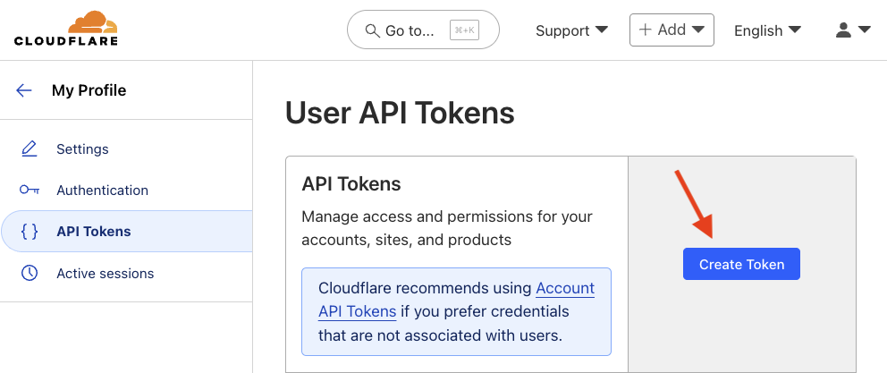
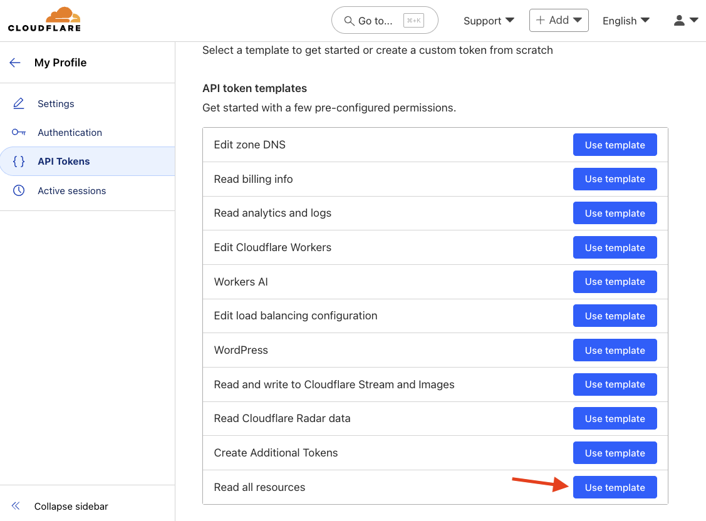
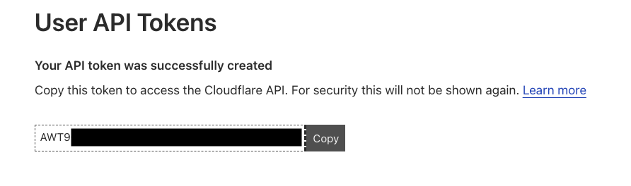

# Cloudflare Workers Workshop

This is a technical workshop that serves as a learning experience for Cloudflare Workers.

## Setup

The easiest way to get started is by using the **Deploy to Cloudflare** button below. This will automatically deploy the project to your Cloudflare Account and create a private copy of the repository in your own GitHub account.

[](https://deploy.workers.cloudflare.com/?url=https://github.com/TimoWilhelm/cloudflare-workers-workshop/tree/main/)

After the project has been deployed you will be able to access the project at the link that is displayed on the page.


Clicking on the preview link will open the automatically configured `workers.dev` domain for your project and should display the message "Hello World" in your web browser.


> [!NOTE]
> Congratulations! You have successfully deployed your own Cloudflare Worker to over 330 location on the Global Cloudflare Network 🥳

## Development Environment

To run this project locally, you need to have a few development tools installed on your machine

<details>
<summary>git</summary>
Git is a distributed version control system that helps you manage different versions of you code and download projects from GitHub or other websites.
</details>

<details>
<summary>JavaScript</summary>
JavaScript is a programming language that is most well-known as the scripting language for Web pages.
</details>

<details>
<summary>TypeScript</summary>
TypeScript is a strongly typed programming language that builds on JavaScript, giving you better tooling. It converts to normal JavaScript, which runs anywhere JavaScript runs.
</details>

<details>
<summary>Node.js</summary>
Node.js is a runtime to run JavaScript code outside of Web browsers.
</details>

<details>
<summary>NPM</summary>
NPM stands for "Node Package Manager" and it allows you to download code written by other people and import it into your projects. It comes bundled with Node.js
</details>

<details>
<summary>Wrangler</summary>
Wrangler is a command line tool to manage the local development of Cloudflare Workers. It uses an emulator ([Miniflare](https://developers.cloudflare.com/workers/testing/miniflare/)) under the hood to simulate the same environment the code would run in on Cloudflare.
</details>

### Editing in GitHub Codespaces (recommended)

You can use GitHub Codespaces to get a fully configured development environment for this project, running directly in your web browser without installing any additional software.

> [!IMPORTANT]  
> Make sure to navigate to your copy of the repository in your own GitHub account when creating your codespace instance.


> [!NOTE]
> GitHub Codespaces offers a monthly [free usage](https://docs.github.com/en/billing/concepts/product-billing/github-codespaces#free-quota) quota of compute time and storage for personal GitHub accounts. This should be enough to finish the workshop. For more information about the pricing, please see the [GitHub Codespaces documentation](https://docs.github.com/en/billing/concepts/product-billing/github-codespaces).

### Editing locally (**skip when using GitHub Codespaces**)

Please make sure you have [Node.js](https://nodejs.org/) version 20 or higher installed on your machine.

You can check the version of Node.js by running `node --version` in your terminal.

```bash
$ node --version
v22.16.0
```

You will also need to have [git](https://git-scm.com/) installed on your machine to clone the repository.

```bash
$ git clone https://github.com/TimoWilhelm/cloudflare-workers-workshop.git
cloning into 'cloudflare-workers-workshop'
```

## Installing the project dependencies

[Open a terminal](https://code.visualstudio.com/docs/terminal/basics) in your editor. Run the following command to install the project dependencies:

> [!NOTE]
> When using GitHub Codespaces, this command should automatically be executed when you open the project for the first time.

```bash
$ npm install
...
added 53 packages, and audited 54 packages in 5s
```

You will only need to run this command again if you modify the dependencies in the `package.json` file.

## Starting the development server

Run the following command to start the project locally by navigating to the "Run and Debug" section in VS Code and clicking on the green play button.


Alternatively, you can run the following command in your terminal:

```bash
$ npm run dev
...
⎔ Starting local server...
[wrangler:info] Ready on http://localhost:8787
```

If you are running in GitHub Codespaces, you should see a pop-up that your application in now available.
Click on the "Open in browser" button to open the application in your web browser. The preview will be automatically updated when you make changes to the code.



You should also see the following message in your terminal:

```bash
 ⛅️ wrangler 4.37.0
───────────────────
╭──────────────────────────────────────────────────────────────────────╮
│  [b] open a browser [d] open devtools [c] clear console [x] to exit  │
╰──────────────────────────────────────────────────────────────────────╯
⎔ Starting local server...
[wrangler:info] Ready on http://localhost:8787
```

If you are running locally, you can either press the "b" key to open the application in your web browser or manually navigate to `http://localhost:8787` in your web browser.

## Signing-in with Wrangler

To be able to run some commands, you will need to sign-in with Wrangler

If you are running locally, run the following command: 

```bash
$ npx wrangler login
Attempting to login via OAuth...
```

This should open a browser window where you can sign-in with your Cloudflare account.

If you are running on GitHub Codespaces, you will need to sign-in using a personal access token.

From the [Cloudflare dashboard](https://dash.cloudflare.com/profile/api-tokens/), go to your profile menu.



Click on "API Tokens" and then "Create Token".



Select the "Read all resources" API token templates.



Scroll down and click on "Continue to Summary" and finally on "Create Token".

> [!CAUTION]
> The token secret is only shown once. Do not store the secret in plaintext where others can access it. Anyone with this token can perform the authorized actions against the resources that the token has access to.



Copy the token and run the following command to set the `CLOUDFLARE_API_TOKEN` environment variable:

> [!NOTE]
> You might need to allow the Codespaces editor to allow pasting from your clipboard.

```bash
export CLOUDFLARE_API_TOKEN=<YOUR_API_TOKEN>
```

You can confirm that you are logged-in successfully using the following command:

```bash
$ npx wrangler whoami
Getting User settings...
👋 You are logged in with an OAuth Token, associated with the email test@example.com
```
