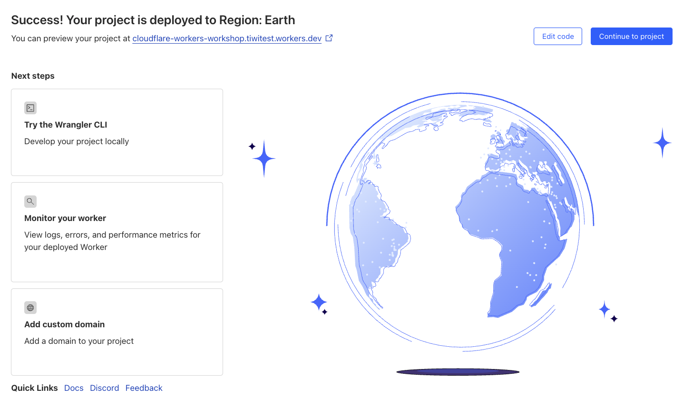
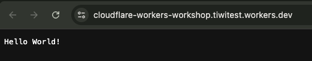
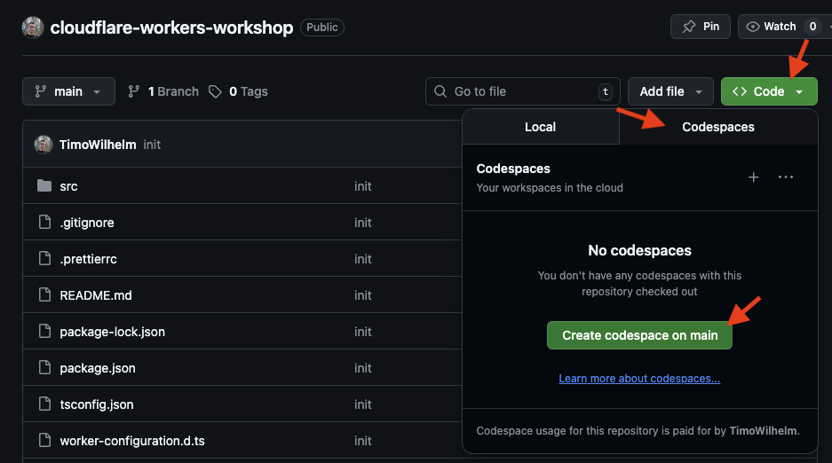
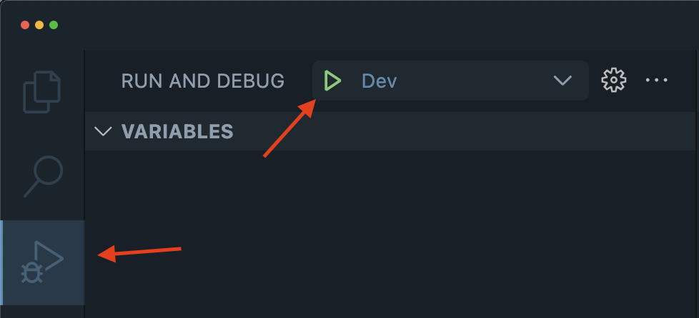

# Cloudflare Workers Workshop

This is a technical workshop that serves as a learning experience for Cloudflare Workers.

## Setup

The easiest way to get started is by using the **Deploy to Cloudflare** button below. This will automatically deploy the project to your Cloudflare Account and create a private copy of the repository in your own GitHub account.

[](https://deploy.workers.cloudflare.com/?url=https://github.com/TimoWilhelm/cloudflare-workers-workshop/tree/main/)

After the project has been deployed you will be able to access the project at the link that is displayed on the page.



Clicking on the preview link will open the automatically configured `workers.dev` domain for your project and should display the message "Hello World" in your web browser.



> [!NOTE]
> Congratulations! You have successfully deployed your own Cloudflare Worker to over 330 location on the Global Cloudflare Network 🥳

## Editing on GitHub Codespaces (recommended)

You can use GitHub Codespaces to get a fully configured development environment for this project, running directly in your web browser without installing any additional software.

> [!IMPORTANT]  
> Make sure to navigate to your copy of the repository in your own GitHub account when creating your codespace instance.



GitHub Codespaces offers a monthly [free usage](https://docs.github.com/en/billing/concepts/product-billing/github-codespaces#free-quota) quota of compute time and storage for personal GitHub accounts. This should be enough to finish the workshop. For more information about the pricing, please see the [GitHub Codespaces documentation](https://docs.github.com/en/billing/concepts/product-billing/github-codespaces).

## Editing locally (skip when using GitHub Codespaces)

To run this project locally, you need to have a few tools installed on your machine:

Please make sure you have [Node.js](https://nodejs.org/) version 20 or higher installed on your machine.

You can check the version of Node.js by running `node --version` in your terminal.

```bash
$ node --version
v22.16.0
```

You will also need to have [git](https://git-scm.com/) installed on your machine to clone the repository.

```bash
$ git clone https://github.com/TimoWilhelm/cloudflare-workers-workshop.git
cloning into 'cloudflare-workers-workshop'
```

## Installing the project dependencies

[Open a terminal](https://code.visualstudio.com/docs/terminal/basics) in your editor. Run the following command to install the project dependencies:

```bash
$ npm install
...
added 53 packages, and audited 54 packages in 5s
```

You will only need to run this command again if you modify the dependencies in the `package.json` file.

## Starting the project locally

Run the following command to start the project locally by navigating to the "Run and Debug" section in VS Code and clicking on the green play button.



Alternatively, you can run the following command in your terminal:

```bash
$ npm run dev
...
⎔ Starting local server...
[wrangler:info] Ready on http://localhost:8787
```
